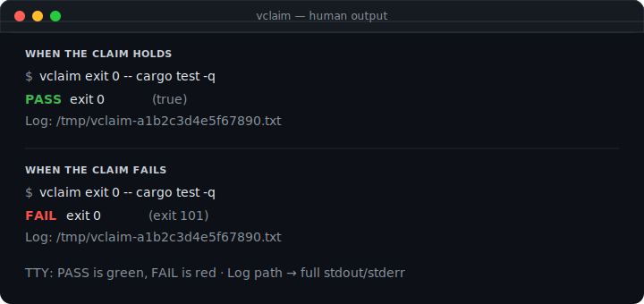

<div align="center">

<pre>
╔══════════════════════════════════════════════════════╗
║                                                      ║
║   ██    ██  ██████  ██       █████  ██ ███    ███    ║
║   ██    ██ ██       ██      ██   ██ ██ ████  ████    ║
║   ██    ██ ██       ██      ███████ ██ ██ ████ ██    ║
║    ██  ██  ██       ██      ██   ██ ██ ██  ██  ██    ║
║     ████    ██████  ███████ ██   ██ ██ ██      ██    ║
║                                                      ║
║              ✓  claim · check · ground               ║
║                                                      ║
╚══════════════════════════════════════════════════════╝
</pre>

### **Stop agents from lying.**

**vclaim** — claim checker for agent grounding

Agents (and humans) assert *“tests pass”*, *“status is ok”*, *“diff is clean”* —
often wrong. **vclaim** turns those assertions into small, named claims: run a command
or inspect the workspace, get **pass/fail with evidence**. No test harness. No YAML
framework. Pretty output for humans; **JSONL for agents**.

Ground every *“done”* in a check.

<p>
  <a href="https://github.com/ousatov-ua/vclaim/actions/workflows/ci.yml"></a>
  <a href="https://github.com/ousatov-ua/vclaim/actions/workflows/security-check.yml"></a>
  <a href="https://github.com/ousatov-ua/vclaim/releases/latest"></a>
  <a href="https://github.com/ousatov-ua/vclaim/releases/latest"></a>
  <a href="LICENSE"></a>
  <a href="https://github.com/ousatov-ua/vclaim/stargazers"></a>
</p>

<p>
  <a href="#install">Install</a>&nbsp;&nbsp;·&nbsp;&nbsp;
  <a href="#quick-start">Quick start</a>&nbsp;&nbsp;·&nbsp;&nbsp;
  <a href="#claim-kinds-v01">Claims</a>&nbsp;&nbsp;·&nbsp;&nbsp;
  <a href="#how-it-works">How it works</a>&nbsp;&nbsp;·&nbsp;&nbsp;
  <a href="docs/claims.md">Docs</a>&nbsp;&nbsp;·&nbsp;&nbsp;
  <a href="https://github.com/ousatov-ua/vclaim/releases/latest">Releases</a>
</p>

</div>

---

| Without **vclaim** | With **vclaim** |
|-----------------|--------------|
| Agent: *“tests passed”* — maybe? | `vclaim exit 0 -- cargo test -q`<br> `exit 0  (true)` |
| Agent: *“tests passed”* — they didn’t | `vclaim exit 0 -- cargo test -q`<br> `exit 0  (exit 101)` |
| *“Health is fine”* — hand-waved | `vclaim json '.status == "healthy"' -- curl …`<br> `json .status == "healthy"  (matched)` |
| *“Health is fine”* — path missing | `vclaim json .status -- curl …`<br> `json .status  (path .status missing)` |
| *“Repo is clean”* … isn’t | `vclaim git clean`<br> `git clean  (working tree dirty)` |
| Ad-hoc shell in agent loops | Batch claims + `--format jsonl` for tools |

---

## Install

### Homebrew

```bash
brew tap ousatov-ua/vclaim
brew trust --formula ousatov-ua/vclaim/vclaim
brew install vclaim
```

### Prebuilt binaries

Grab the asset for your OS from the
[latest release](https://github.com/ousatov-ua/vclaim/releases/latest):

| Platform | Asset |
|----------|--------|
| Linux (amd64) | `vclaim-<version>-linux-amd64.tar.gz` |
| macOS (arm64) | `vclaim-<version>-darwin-arm64.tar.gz` |
| Windows (amd64) | `vclaim-<version>-windows-amd64.zip` |

```bash
# Linux / macOS — unpack and install to PATH
tar -xzf vclaim-*-linux-amd64.tar.gz   # or vclaim-*-darwin-arm64.tar.gz
install -m 0755 vclaim ~/.local/bin/vclaim

# or with GitHub CLI
gh release download -R ousatov-ua/vclaim -p 'vclaim-*-linux-amd64.tar.gz'
```

### From source

```bash
cargo install --path .
# or from a clone:
cargo build --release && cp target/release/vclaim ~/.local/bin/
```

Requires a Rust toolchain (edition 2021). Runtime needs `git` on `PATH` only for `git` claims.

## Quick start

```bash
vclaim exit 0 -- cargo test -q
vclaim json '.status == "healthy"' -- curl -s localhost:8080/health
vclaim stdout !contains 'DEPRECATED' -- ./migrate --dry-run
vclaim git clean
vclaim files exist src/main.rs Cargo.toml
vclaim duration lt 30s -- npm test
vclaim env set DATABASE_URL
```

### What humans see

On a TTY, verdicts are **colorized** (green pass / red fail). Force color with
`--color always` (or turn off with `--color never` / `NO_COLOR`).

<p align="center">
  
</p>

**OK — claim holds**

```bash
$ vclaim exit 0 -- cargo test -q
```

<pre>
<span style="color:#3fb950;font-weight:700">PASS</span>  exit 0  (true)

Log: /tmp/vclaim-a1b2c3d4e5f67890.txt
</pre>

**NOT OK — claim fails** (non-zero process exit; `vclaim` itself exits `1`)

```bash
$ vclaim exit 0 -- cargo test -q
```

<pre>
<span style="color:#f85149;font-weight:700">FAIL</span>  exit 0  (exit 101)

Log: /tmp/vclaim-a1b2c3d4e5f67890.txt
</pre>

More examples:

<pre>
<span style="color:#3fb950;font-weight:700">PASS</span>  stdout contains OK  (matched)
<span style="color:#3fb950;font-weight:700">PASS</span>  git clean  (working tree clean)
<span style="color:#f85149;font-weight:700">FAIL</span>  json .status  (path .status missing)

Log: /tmp/vclaim-….txt
</pre>

### Log file (important)

Terminal lines are a **short pass/fail summary only**. After every run, `vclaim`
writes the **complete** captured stdout/stderr (plus verdicts) to a unique file
in the OS temp directory:

| OS | Temp directory |
|----|----------------|
| Linux | usually `/tmp` |
| macOS | usually `/var/folders/…` or `/tmp` |
| Windows | `%TEMP%` / `%TMP%` |

Filename pattern: **`vclaim-<unique-hex>.txt`**.

- **Human:** footer prints `Log: <path>`.
- **JSONL:** last line is `{"log":"<path>"}`

**Agents and humans should open that path** whenever evidence is insufficient —
it is the full record of what was tested, not just the one-line claim result.

### Batch / agent mode

```bash
vclaim --format jsonl <<'EOF'
exit 0 -- cargo test -q
json '.ok' -- curl -s "$URL/health"
git clean
EOF
```

## How it works

| Form | Role |
|------|------|
| `vclaim <claim> -- <cmd…>` | Run command, check claim against result |
| `vclaim <claim>` | Workspace/env claims (no command): `git`, `files`, `env` |
| `vclaim --format jsonl` | One JSON object per claim (agent default) |
| `vclaim --color auto\|always\|never` | Human color (default `auto`: TTY, no `NO_COLOR`) |
| `vclaim --timeout 30s …` | Kill command after duration; exit `2` on timeout |
| `vclaim -f claims.txt` | Batch claims from file (`-` = stdin) |
| Log file | Always written under OS temp as `vclaim-<hex>.txt`; path at end of output |

No plugins, no YAML test framework, no CI runner. Claims only.

Process exit codes:

| Code | Meaning |
|------|---------|
| `0` | All claims passed |
| `1` | One or more claims failed |
| `2` | Usage, parse, spawn, timeout, I/O, or git-tool error |

## Claim kinds (v0.1)

### `exit` — process status

```bash
vclaim exit 0 -- cargo test -q
vclaim exit nonzero -- false
vclaim exit 101 -- sh -c 'exit 101'
```

### `stdout` / `stderr` — stream content

```bash
vclaim stdout contains OK -- ./build
vclaim stdout !contains DEPRECATED -- ./migrate --dry-run
vclaim stdout equals done -- printf done
vclaim stdout matches 'error: .+' -- ./check
vclaim stderr contains panic -- ./run
```

Ops: `contains`, `!contains`, `equals` (one trailing newline stripped), `matches` (Rust regex, unanchored). Invalid regex → exit `2`.

### `json` — jq-lite path on command stdout

```bash
vclaim json .ok -- curl -s "$URL/health"
vclaim json .status exists -- curl -s "$URL/health"
vclaim json .status == healthy -- curl -s "$URL/health"
vclaim json '.status == "healthy"' -- curl -s "$URL/health"
```

Path language (not full jq):

- Dotted segments: `.status`, `items.0.name` (leading `.` optional)
- Numeric segments are array indexes
- No filters, pipes, wildcards, or functions

Modes:

| Form | Meaning |
|------|---------|
| `json PATH` | Path exists and value is **truthy** (not `null` / `false` / `0` / `""` / `[]` / `{}`) |
| `json PATH exists` | Path present (`null` counts) |
| `json PATH == VALUE` | Deep equality; `VALUE` is a JSON literal or bare string |

Invalid JSON body → **claim fail** (exit `1`), not usage error.

### `files` — path existence

```bash
vclaim files exist src/main.rs Cargo.toml
vclaim files !exist tmp/scratch
```

No command allowed. Paths are relative to the current working directory.

### `env` — variable presence

```bash
vclaim env set DATABASE_URL HOME
vclaim env !set AWS_SECRET_ACCESS_KEY
```

Empty string counts as **set**. **Values are never printed** in human or JSONL evidence.

### `git` — working tree

```bash
vclaim git clean
vclaim git dirty
```

Uses `git status --porcelain`. Not a git repository → claim **fail** (exit `1`).  
Git binary missing / status invocation failure → **exit `2`** (cannot evaluate).

### `duration` — wall clock

```bash
vclaim duration lt 30s -- npm test
vclaim duration lt 500ms -- ./fast-check
vclaim duration lt 2m -- cargo test
```

Units: `ms`, `s`, `m`. Comparator in v0.1: **`lt` only**.

## Output

**Human (default):** green `PASS` / red `FAIL`, claim text, evidence in parentheses.  
Color: `--color auto` (default) only when stdout is a TTY and `NO_COLOR` is unset; `--color always|never` override.

```text
PASS  exit 0  (true)
FAIL  json .status  (path .status missing)
```

**Agent (`--format jsonl`):** one record per claim:

```json
{"claim":"exit 0","ok":true,"exit":0,"ms":1234,"evidence":"exit 0"}
{"claim":"json .status","ok":false,"exit":0,"ms":80,"evidence":"path .status missing"}
```

## Batch files

```text
# claims.txt
exit 0 -- cargo test -q
json .ok -- curl -s localhost:8080/health
git clean
files exist Cargo.toml
```

```bash
vclaim -f claims.txt
vclaim --format jsonl -f claims.txt
vclaim -f - < claims.txt
```

Blank lines and `#` comments (full-line or mid-line outside quotes) are skipped. Claims run sequentially; claim failures do not stop the batch; parse/spawn/timeout/git-tool errors abort with exit `2`.

Captured stdout/stderr are capped at 1 MiB per stream.

## Documentation

| Doc | Contents |
|-----|----------|
| [docs/claims.md](docs/claims.md) | Grammar freeze, edge cases, evidence rules |
| [docs/json-subset.md](docs/json-subset.md) | jq-lite path language limits |
| [vclaim.md](vclaim.md) | Product pitch and scope |

## Develop

```bash
cargo test
cargo build --release
cargo run -- exit 0 -- true
```

## Scope

**In:** spawn command, capture exit/stdout/stderr/time; pure path/env/git checks; small JSON path language; JSONL.

**Out:** browser E2E, flake retry, remote CI, monorepo graphs, full jq, secret scanning, network mocking, shell-by-default.

## License

MIT
